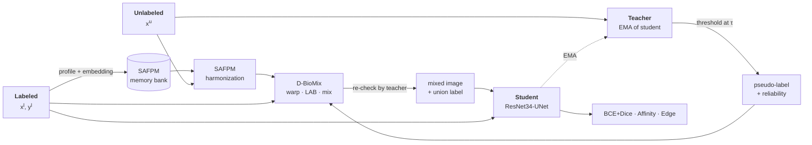

<div align="center">

# TriSynNet

**Beyond Decoupled Augmentation: Co-Designing Semantic Frequency and Deformable Mixing for Semi-Supervised Polyp Segmentation**

[](https://www.python.org/)
[](https://pytorch.org/)
[](https://lightning.ai/)
[](LICENSE)
[](#citation)

Semi-supervised polyp segmentation that co-designs **spectral augmentation**, **deformable mixing**, and the **consistency loss** that supervises them.

</div>

---

> [!NOTE]
> This repository accompanies a manuscript under peer review. The **complete, runnable implementation of the method** is available here; quantitative tables, pretrained checkpoints, and the final citation entry follow upon acceptance.

## Overview

Pixel-level annotation of colonoscopy frames is expensive, so practical polyp segmentation must learn from a small labeled set plus a large unlabeled pool. Mean Teacher consistency training is the standard recipe, but endoscopy breaks two of its assumptions: **appearance shifts** across scopes and centers destabilize teacher pseudo-labels, and **weak, low-contrast boundaries** are invisible to losses defined on absolute pixel values.

TriSynNet answers both with three components that are designed *together* rather than stacked — each augmentation is paired with the loss term that can supervise it.

| Component | Module | Mechanism | Paired loss term |
| :-- | :-- | :-- | :-- |
| **SAFPM**<br/>Semantic-Aware Frequency Profile Matching | `models/safpm.py` | A memory bank of *directional* frequency profiles (Laplacian high-band → FFT → $K$ angular sectors), each keyed by a semantic embedding. Softmax attention retrieves a profile per unlabeled image and blends it into the amplitude spectrum only — phase, and therefore geometry, is untouched. | `LocalAffinityLoss` |
| **D-BioMix**<br/>Deformable Bio-Harmonized Mixing | `models/d_biomix.py` | Pastes a labeled source into an unlabeled target under LAB luminance matching and a sparse $G \times G$ control-point warp (bicubic-upsampled), then re-harmonizes the composite. Anatomically plausible edges instead of CutMix rectangles. | `EdgeAlignmentLoss` |
| **TriSynergy Loss** | `losses.py` | Curriculum-weighted sum of BCE+Dice, a correlation term invariant to spectral shift, and a Sobel orientation term gated by teacher reliability. | — |

### Pipeline



Per iteration: the teacher labels the unlabeled batch; labeled features refresh the bank; D-BioMix synthesizes a composite whose label is the **union** of three sources (target pseudo-label, warped source ground truth, teacher re-check on the harmonized composite); the student is optimized on the labeled view plus that composite. No gradient flows through the bank, the retrieval, or the teacher: the composite enters the loss as a constant. Neither module is invoked at inference, so deployment cost equals the plain backbone.

## Repository layout

```
trisynnet/
├── models/
│   ├── backbone.py     # ResNet34UNet, ResNet34UNet_SSL (+ extract_features)
│   ├── safpm.py        # frequency-profile bank + adaptive harmonization
│   └── d_biomix.py     # LAB matching, control-point warp, mixing
├── data/dataset.py     # SemiSupervisedPolypDS, build_semisup_loaders
├── losses.py           # LocalAffinity, EdgeAlignment, TriSynergy, BceDice
├── metrics.py          # Dice/IoU/Pre/Rec + HD95/ASSD/Boundary IoU/Boundary F1
├── config.py           # TrainingConfig
└── system.py           # PolypSSLSystem, PolypDataModule
train.py                # CLI: new / finetune / test
```

## Installation

```bash
git clone https://github.com/Ngoc-LM/SSL4PolypSeg.git && cd SSL4PolypSeg
python -m venv .venv && source .venv/bin/activate
pip install -r requirements.txt
```

Python ≥ 3.9, PyTorch ≥ 2.0. A CUDA GPU is expected (`config.device` defaults to `cuda`); the reported setting fits a single 16 GB card under fp16.

## Data preparation

All splits live in **one `.npz` archive**, keyed `{split}_img` / `{split}_msk`:

| Key prefix | Role |
| :-- | :-- |
| `train` | Pool for **both** labeled and unlabeled subsets, partitioned by `labeled_ratio` + `seed`. |
| `val` | Held-in validation — the only split that drives checkpointing, early stopping, and LR scheduling. |
| `test_kvasir`, `test_clinic`, `test_colon`, `test_cvc300`, `test_etis` | Held-out test splits; loaded if present, any subset may be omitted. |

**Format.** Images are **BGR `uint8`** (OpenCV convention); masks may be `{0,1}` or `{0,255}` and are normalized on load. Each training sample yields two views: a *weak* geometric view for the teacher (flips, rot90, affine) and a *strong* photometric view for the student (RGB/HSV shift, brightness–contrast, Gaussian noise/blur).

**Reproducing the split.** The labeled/unlabeled partition is a seeded shuffle of the training indices, not a stored file:

```python
build_semisup_loaders(..., labeled_ratio=0.1, seed=42)
```

> [!IMPORTANT]
> **No test leakage by construction.** `guard_val_dataset()` raises if `config.val_dataset` points at any `test_*` split, so model selection can never see out-of-domain data. Test splits are read only by the separate test step.

## Usage

```bash
# Train from scratch
python train.py --mode new --data_path data/polyp_dataset.npz \
    --max_epochs 100 --labeled_ratio 0.1 --seed 42

# Resume or fine-tune
python train.py --mode finetune --resume_ckpt checkpoints/last.ckpt

# Evaluate on every held-out test split present in the archive
python train.py --mode test --resume_ckpt checkpoints/best.ckpt
```

### Ablations

| Configuration | Flags |
| :-- | :-- |
| Full TriSynNet | *(defaults)* |
| w/o SAFPM | `--no_safpm` |
| w/o D-BioMix | `--no_d_biomix` |
| w/o TriSynergy loss | `--loss_type bce_dice` |
| Mean Teacher baseline | `--no_safpm --no_d_biomix --loss_type bce_dice` |

### Configuration

Defaults in `trisynnet/config.py` are exactly the manuscript setting.

| Group | Parameters | Values |
| :-- | :-- | :-- |
| **Data** | `img_size` / `val_size` · `labeled_ratio` | 256 / 256 · 0.1 |
| | `batch_train` (effective; 32 labeled + 32 unlabeled) / `batch_val` | 64 / 8 |
| **SAFPM** | `bank_size` · `feature_dim` · `num_sectors` · `pyramid_levels` | 50 · 512 · 8 · 3 |
| | `base_gamma` → `max_gamma` · `temperature` · `bank_ema_alpha` | 0.05 → 0.20 · 0.07 · 0.99 |
| **D-BioMix** | `grid_size` · `deform_magnitude` · `mix_prob` | 6 · 0.15 · 0.5 |
| **Mean Teacher** | `ema_alpha` · `rampup_epochs` · `tau` | 0.99 · 20 · 0.85 |
| **Optimization** | AdamW + `ReduceLROnPlateau` on `val/Dice` | — |
| | `lr` → `min_lr` · `weight_decay` · `max_epochs` | 1e-4 → 1e-7 · 1e-4 · 100 |
| | `precision` · `grad_clip_norm` · `seed` | `16-mixed` · 1.0 · 42 |

## Evaluation protocol

`trisynnet/metrics.py` reports region overlap alongside boundary-specific metrics — the latter are the discriminative ones in the weak-boundary regime this work targets.

| Metric | Definition |
| :-- | :-- |
| **Dice**, **IoU**, **Precision**, **Recall** | Per-sample region overlap at threshold 0.5. |
| **HD95**, **ASSD** | 95th-percentile Hausdorff distance and average symmetric surface distance, in pixels. |
| **Boundary IoU** | Cheng *et al.*, CVPR 2021, with the dilation band scaled to the image diagonal so it is invariant to polyp size. |
| **Boundary F1** | Boundary precision/recall at a 2-pixel tolerance. |

Degenerate cases are reported, not silently averaged away: when exactly one of prediction and ground truth is empty, HD95 and ASSD are undefined (`nan`), and `aggregate_boundary_metrics` returns `n_total` and `n_excluded_nan` alongside `mean` and `std` so every exclusion is auditable.

## Results

Quantitative results on Kvasir-SEG, CVC-ClinicDB, CVC-ColonDB, CVC-300, and ETIS-LaribPolypDB, together with the full ablation study and pretrained checkpoints, will be published here upon acceptance.

## Citation

The final entry will be added once the manuscript is accepted; until then, please cite the repository:

```bibtex
@misc{trisynnet2026,
  title        = {Beyond Decoupled Augmentation: Co-Designing Semantic Frequency and Deformable Mixing for Semi-Supervised Polyp Segmentation},
  author       = {{TriSynNet Authors}},
  year         = {2026},
  howpublished = {\url{https://github.com/Ngoc-LM/SSL4PolypSeg}},
  note         = {Manuscript under review}
}
```

## License

Released under the MIT License — see [LICENSE](LICENSE).
