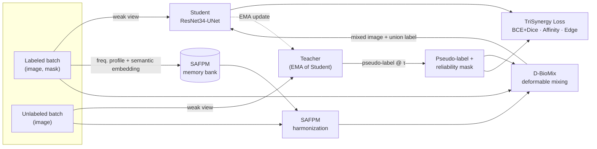

<div align="center">

# TriSynNet

**Beyond Decoupled Augmentation: Co-Designing Semantic Frequency and Deformable Mixing for Semi-Supervised Polyp Segmentation**

[](https://www.python.org/)
[](https://pytorch.org/)
[](https://lightning.ai/)
[](LICENSE)
[](#citation)

</div>

---

> [!NOTE]
> **Manuscript status.** This repository accompanies a manuscript currently under peer review. The **complete, runnable core implementation of the method is available here**. Quantitative results, pretrained checkpoints, and the final citation entry will be released upon acceptance.

## Overview

Annotating colonoscopy frames at pixel level is expensive, so practical polyp segmentation must learn from a small labeled set plus a large pool of unlabeled frames. The dominant semi-supervised recipe — Mean Teacher with consistency regularization — is weakened in endoscopy by two domain-specific effects: (i) **appearance shift** across scopes, centers, and illumination, which makes teacher pseudo-labels unstable, and (ii) **weak, low-contrast boundaries**, which consistency losses defined on absolute pixel values fail to preserve.

**TriSynNet** addresses both with three coupled components on top of a Mean Teacher framework with a ResNet34-UNet backbone:

| Component | Module | Purpose |
| :-- | :-- | :-- |
| **SAFPM** — Semantic-Aware Frequency Profile Matching | `trisynnet/models/safpm.py` | Harmonizes the appearance of unlabeled frames toward in-domain frequency statistics, **without altering content**. |
| **D-BioMix** — Deformable Bio-Harmonized Mixing | `trisynnet/models/d_biomix.py` | Synthesizes anatomically plausible labeled↔unlabeled composites with a partially reliable label. |
| **TriSynergy Loss** — curriculum-weighted consistency | `trisynnet/losses.py` | Enforces consistency that is invariant to SAFPM style shifts *and* D-BioMix geometric shifts. |

### Pipeline



### Method details

- **Backbone** (`models/backbone.py`) — ImageNet-pretrained ResNet34 encoder (`IMAGENET1K_V1`) with a symmetric U-Net decoder (`ResNet34UNet`, `ResNet34UNet_SSL`), exposing an `extract_features` head consumed by SAFPM and D-BioMix.
- **SAFPM** (`models/safpm.py`) — Maintains a memory bank of *directional frequency profiles* extracted from the high-frequency bands of a Laplacian pyramid, each paired with a semantic embedding learned online from labeled images. On unlabeled images, attention over the bank retrieves the most semantically relevant entries and adaptively blends their frequency statistics into the image (blend strength ramped from `base_gamma` to `max_gamma`), harmonizing style while preserving structure.
- **D-BioMix** (`models/d_biomix.py`) — Mixes a labeled *source* image into an unlabeled *target* image via a smooth, sparse control-point deformation field, LAB-space luminance matching, and SAFPM harmonization of the composite. The mixed label is the **union** of three sources: the original teacher pseudo-label, the warped source ground truth, and a second teacher pass over the harmonized composite.
- **TriSynergy Loss** (`losses.py`) — Supervised `BceDiceLoss` on labeled data, plus a curriculum-weighted blend of:
  - `LocalAffinityLoss` — a correlation-level term matching *local pixel relationships* rather than absolute values, so it survives SAFPM's style shift;
  - `EdgeAlignmentLoss` — a Sobel-based term aligning predicted boundary *orientation* with the teacher's, gated by the reliability mask and penalizing spurious off-boundary gradients, so it survives D-BioMix's geometric shift.
- **Training loop** (`system.py`) — Mean Teacher orchestration as a PyTorch Lightning `LightningModule` / `LightningDataModule`: the student is trained by gradient descent and the teacher is an EMA copy whose decay is warmed up as `min(1 - 1/(t+1), ema_alpha)`, so early steps track the student closely. The consistency weight follows the standard Gaussian ramp-up `exp(-5(1-p)^2)` over `rampup_epochs`.

## Repository layout

```
trisynnet/
├── models/
│   ├── backbone.py     # ResNet34UNet, ResNet34UNet_SSL
│   ├── safpm.py        # SAFPM — frequency profile bank + harmonization
│   └── d_biomix.py     # D_BioMix — deformable bio-harmonized mixing
├── data/
│   └── dataset.py      # SemiSupervisedPolypDS, build_semisup_loaders
├── losses.py           # LocalAffinityLoss, EdgeAlignmentLoss, TriSynergyLoss, BceDiceLoss
├── metrics.py          # Dice/IoU/Precision/Recall + HD95/ASSD/Boundary IoU/Boundary F1
├── config.py           # TrainingConfig (all hyper-parameters)
└── system.py           # PolypSSLSystem, PolypDataModule
train.py                # CLI entrypoint (new / finetune / test)
requirements.txt
```

## Installation

```bash
git clone https://github.com/Ngoc-LM/SSL4PolypSeg.git
cd SSL4PolypSeg

python -m venv .venv && source .venv/bin/activate   # or: conda create -n trisynnet python=3.10
pip install -r requirements.txt
```

Tested with Python ≥ 3.9 and PyTorch ≥ 2.0. A CUDA-capable GPU is strongly recommended (`config.device` defaults to `cuda`).

## Data preparation

Training and evaluation read a **single `.npz` archive** containing paired image/mask arrays per split, keyed as `{split}_img` and `{split}_msk`:

| Key prefix | Role |
| :-- | :-- |
| `train` | Source of **both** the labeled and unlabeled subsets, split deterministically by `labeled_ratio` and `seed`. |
| `val` | Held-in validation split, used for checkpointing, early stopping, and LR scheduling. |
| `test_kvasir`, `test_clinic`, `test_colon`, `test_cvc300`, `test_etis` | Held-out test splits. Loaded automatically if present; any subset may be omitted. |

**Format.** Images are expected in **BGR `uint8`** (as read by OpenCV); masks may be `{0, 1}` or `{0, 255}` and are normalized internally. `SemiSupervisedPolypDS` / `build_semisup_loaders` in `trisynnet/data/dataset.py` document the exact loading and augmentation pipeline — weak geometric views (flips, rot90, affine) for the teacher branch and strong photometric views (RGB/HSV shift, brightness–contrast, Gaussian noise/blur) for the student branch.

**Reproducing the paper split.** The labeled/unlabeled partition is derived from a *seeded shuffle* of the training indices — it is not stored as a separate file. The exact split used in the manuscript is reproduced by:

```python
build_semisup_loaders(..., labeled_ratio=0.1, seed=42)
```

> [!IMPORTANT]
> **No test leakage by construction.** `config.val_dataset` is guarded by `guard_val_dataset()` (`trisynnet/config.py`), which raises if model selection is pointed at any out-of-domain `test_*` split. Test splits are only ever touched by the separate test step.

## Usage

Train from scratch:

```bash
python train.py --mode new \
    --data_path data/polyp_dataset.npz \
    --max_epochs 100 \
    --labeled_ratio 0.1 \
    --seed 42
```

Resume or fine-tune from a checkpoint:

```bash
python train.py --mode finetune --resume_ckpt checkpoints/last.ckpt
```

Evaluate on the held-out test splits:

```bash
python train.py --mode test --resume_ckpt checkpoints/best.ckpt
```

### Ablation studies

Individual components can be disabled from the CLI to reproduce the ablation table:

| Configuration | Command flags |
| :-- | :-- |
| Full TriSynNet | *(defaults)* |
| w/o SAFPM | `--no_safpm` |
| w/o D-BioMix | `--no_d_biomix` |
| w/o TriSynergy loss | `--loss_type bce_dice` |
| Mean Teacher baseline | `--no_safpm --no_d_biomix --loss_type bce_dice` |

### Key hyper-parameters

Full defaults live in `trisynnet/config.py` (`TrainingConfig`); the values below are those used in the manuscript.

| Group | Parameter | Default |
| :-- | :-- | :-- |
| Data | `img_size` / `val_size` | 256 / 256 |
| | `batch_train` / `batch_val` | 16 / 8 |
| | `labeled_ratio` | 0.1 |
| SAFPM | `bank_size`, `feature_dim`, `num_sectors` | 30, 512, 8 |
| | `base_gamma` → `max_gamma` | 0.05 → 0.20 |
| | `temperature`, `pyramid_levels` | 0.07, 3 |
| D-BioMix | `mix_prob`, `grid_size`, `deform_magnitude` | 0.5, 6, 0.15 |
| Mean Teacher | `ema_alpha`, `rampup_epochs`, `tau` | 0.99, 20, 0.85 |
| Optimization | optimizer / scheduler | AdamW / `ReduceLROnPlateau` on `val/Dice` |
| | `lr`, `weight_decay`, `max_epochs` | 1e-4, 1e-4, 100 |
| | `seed` | 42 |

## Evaluation protocol

`trisynnet/metrics.py` reports both region-overlap and boundary-specific metrics, the latter being the discriminative ones for the weak-boundary regime this work targets.

| Metric | Definition |
| :-- | :-- |
| **Dice**, **IoU**, **Precision**, **Recall** | Standard per-sample region overlap at threshold 0.5. |
| **HD95**, **ASSD** | 95th-percentile Hausdorff distance and average symmetric surface distance, in pixels. |
| **Boundary IoU** | Cheng *et al.*, CVPR 2021, with the dilation band scaled to the image diagonal so it is invariant to polyp size. |
| **Boundary F1** | Boundary precision/recall at a 2-pixel tolerance. |

**Degenerate cases are handled explicitly and reported, not silently averaged away.** When exactly one of prediction/ground truth is empty, HD95 and ASSD are undefined (`nan`); `aggregate_boundary_metrics` excludes those samples from the mean and returns `n_total` and `n_excluded_nan` alongside `mean` and `std`, so the number of excluded images is auditable.

## Results

Quantitative results on Kvasir-SEG, CVC-ClinicDB, CVC-ColonDB, CVC-300, and ETIS-LaribPolypDB — together with the ablation study and pretrained checkpoints — will be published here upon acceptance of the manuscript.

## Citation

The citation entry will be added once the manuscript is accepted. In the meantime, please cite the repository:

```bibtex
@misc{trisynnet2026,
  title        = {Beyond Decoupled Augmentation: Co-Designing Semantic Frequency and Deformable Mixing for Semi-Supervised Polyp Segmentation},
  author       = {{TriSynNet Authors}},
  year         = {2026},
  howpublished = {\url{https://github.com/Ngoc-LM/SSL4PolypSeg}},
  note         = {Manuscript under review}
}
```

## License

Released under the MIT License — see [LICENSE](LICENSE).
